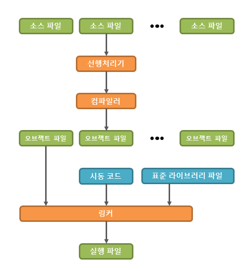

## C++ Concept
1. Procedural Programming style
2. OOP(Object-Oriented Programming) style
3. General Programming Language
___
## C++ process
#### 출처: http://www.tcpschool.com/lectures/img_c_programming.png
